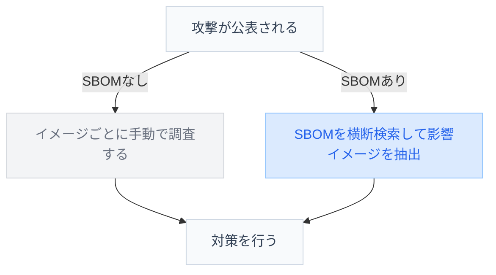

    <h2>サプライチェーン攻撃の影響範囲を調査する</h2>

---
transition: fade
---

    <h2> サプライチェーン攻撃の影響範囲調査（例）</h2>

```mermaid
flowchart TD
    A["攻撃が公表される"]
    B["イメージごとに手動で調査する"]
    C["SBOMを横断検索して影響イメージを抽出"]
    D["対策を行う"]
    A -->|SBOMなし| B
    A -->|SBOMあり| C
    B --> D
    C --> D
    classDef without fill:#f3f4f6,stroke:#d1d5db,color:#6b7280
    classDef with fill:#dbeafe,stroke:#93c5fd,color:#2563eb
    classDef shared fill:#f8fafc,stroke:#cbd5e1,color:#334155
    class B without
    class C with
    class A,D shared
```

---
src: ./architecture.md
---

---
src: ./demo.md
---
