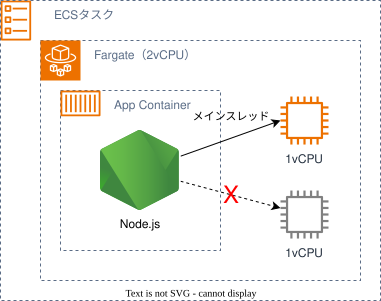

# アプリの特性

::left::

::right::

- Node.jsのメインスレッドは1コアまでしか同時に利用できない
- ネットワークI/Oが中心でほぼメインスレッドで完結するため、1vCPUで十分
- 1vCPUの小さいタスクを大量に並べてリクエストを捌く

<!--
画像: nodejs-icon.svg（Node.js のシングルスレッド特性の説明）

■ 前提：アプリの特性（なぜ1vCPUの小さいタスクなのか）

1. アプリコンテナのランタイムはNode.js
2. Node.jsはアプリケーションの処理をシングルスレッドで実行する
3. アプリの処理はDB・外部APIへの問い合わせといったI/O中心で、CPUに高負荷がかかる処理はない
   - CPUを占有する処理がないため、シングルスレッドでも効率よくリクエストを捌ける
4. シングルスレッドなので、vCPUを2以上割り当てても実際に使えるのは1vCPUぶんだけ
   → アプリコンテナには1vCPUで十分
5. その1vCPUの小さいタスクを、数を多めに並べてリクエストを捌いている（→ 理由①へ続く）

-->
