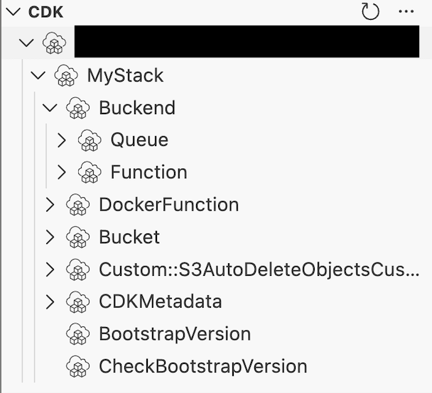

# AWS CDKのSynthesizeで作られるCloudAssemblyって何？

**JAWS-UG 茨城 #11 CDK支部コラボ回**

2026.2.1(土)  
池田 晃尚（@akikii__）

<div class="absolute right-10 bottom-10">
  
</div>

---
layout: two-cols
---

## 自己紹介

- アキキー | 池田 晃尚 ([@akikii__](https://x.com/akikii__))
- 株式会社メイツ Backend Engineer / SRE
- 推しサービスは AWS CDK
- hoge
- fuga


::right::

<div class="flex items-center justify-center h-full">
  
</div>

---
layout: center
class: text-center
---

## CloudAssemblyをご存知ですか？

---
layout: center
class: text-left
---

## cdk.out ディレクトリを見たことありますか？

---

## cdk.out ディレクトリ...？

```text {*|*|7}{maxHeight: '400px'}
📁 cdk.out
├─ 📁 asset.4e8aefdb2...
├─ 📁 asset.9240c61d2...
├─ 📄 cdk.out
├─ 📄 manifest.json
├─ 📄 MyStack.assets.json
├─ 📄 MyStack.template.json
└─ 📄 tree.json
```

<div
  v-click="[1,2]"
  style="
    position: absolute;
    right: 8rem;
    top: 13rem;
    background: rgba(0,0,0,0.75);
    color: white;
    padding: 1rem 1rem;
    border-radius: 1rem;
    max-width: 26rem;
  "
>
  <div style="font-size: 14px; line-height: 2em">
    `cdk synth`, `cdk list`, `cdk deploy`など、特定のCDKのCLIコマンドを実行した時に作成されるファイル群
  </div>
</div>

<div
  v-click="2"
  style="
    position: absolute;
    right: 8rem;
    top: 13rem;
    background: rgba(0,0,0,0.75);
    color: white;
    padding: 1rem 1rem;
    border-radius: 1rem;
    max-width: 26rem;
  "
>
  <div style="font-size: 14px; line-height: 2em">
    cdk.outに出力された&lt;StackName&gt;.template.jsonはCloudFormationテンプレートなのでみたことある人は多いかも？
  </div>
</div>

---

## CloudAssembly とは？

cdk.out ディレクトリに生成されたファイル群のことで、`cdk deploy`で利用される


---
layout: center
class: text-center
---

## ？？？

CloudFormationテンプレートだけじゃだめなの？

---

## CloudAssembly とは？

- なぜCloudAssemblyが必要なのか
- CloudAssemblyの構成要素
- CloudAssemblyはどう実行されるのか

---
layout: section
---

# なぜCloudAssemblyが必要なのか

---
layout: center
class: text-center
---

## CloudFormationテンプレート？

> CloudFormationテンプレートとは

---

## テンプレートだけではデプロイできない（？）

別のファイルとして切り出す必要がある

- Lambda関数のソースコード
- ECSタスクで利用するコンテナイメージ
- Step Functionsの定義ファイル(ASL)

…などなど

→ これらのファイルを<Highlight>アセット</Highlight>と呼びます

---

## アセットがないと本当にデプロイできない？

…？

Lambda関数のソースコードならハードコードしたらデプロイできるのでは？

---

## アセットがないと現実的にデプロイできない

多くの制限があるため、<Highlight>現実的に</Highlight>テンプレートだけでは実現不可能

- [テンプレートにハードコードできるLambda関数のソースコードは4KBまで](https://docs.aws.amazon.com/AWSCloudFormation/latest/TemplateReference/aws-properties-lambda-function-code.html)
- Lambda関数に依存パッケージを含められない(npmモジュールなど)
- Dockerイメージを含められない
- [テンプレートのサイズが 50KiB を超えると S3 にアップロードする必要がある](https://docs.aws.amazon.com/ja_jp/general/latest/gr/cfn.html)

→ アセットは S3 や ECR にアップロードする必要がある（テンプレートもアセットである）

---

## なぜCloudAssemblyが必要なのか？

→ TODO: いい感じにまとめ

---
layout: section
---

# CloudAssemblyの構成要素

---

## \<StackName\>.template.json

````md magic-move
```text {7}{maxHeight: '400px'}
📁 cdk.out
├─ 📁 asset.4e8aefdb2...
├─ 📁 asset.9240c61d2...
├─ 📄 cdk.out
├─ 📄 manifest.json
├─ 📄 MyStack.assets.json
├─ 📄 MyStack.template.json
└─ 📄 tree.json
```
```text {7,9|6-9}{maxHeight: '400px'}
📁 cdk.out
├─ 📁 asset.4e8aefdb2...
├─ 📁 asset.9240c61d2...
├─ 📄 cdk.out
├─ 📄 manifest.json
├─ 📄 MyStack.assets.json
├─ 📄 MyStack.template.json
├─ 📄 MyStackSecond.assets.json
├─ 📄 MyStackSecond.template.json
└─ 📄 tree.json
```
````

<div
  v-click.hide="1"
  style="
    position: absolute;
    right: 15rem;
    top: 13rem;
    background: rgba(0,0,0,0.75);
    color: white;
    padding: 1rem 1rem;
    border-radius: 1rem;
    max-width: 26rem;
  "
>
  <div style="font-size: 14px; line-height: 2em">
    スタックごとのCloudFormationのテンプレート<br>
    先頭にスタック名が付く
  </div>
</div>

<div
  v-click="[1,2]"
  style="
    position: absolute;
    right: 10rem;
    top: 14rem;
    background: rgba(0,0,0,0.75);
    color: white;
    padding: 1rem 1rem;
    border-radius: 1rem;
    max-width: 26rem;
  "
>
  <div style="font-size: 14px; line-height: 2em">
    スタックが増えれば、&lt;StackName&gt;.template.jsonも増える
  </div>
</div>

<div
  v-click="2"
  style="
    position: absolute;
    right: 10rem;
    top: 14rem;
    background: rgba(0,0,0,0.75);
    color: white;
    padding: 1rem 1rem;
    border-radius: 1rem;
    max-width: 26rem;
  "
>
  <div style="font-size: 14px; line-height: 2em">
    スタックが増えれば、&lt;StackName&gt;.template.jsonも増える<br>
    ※ &lt;StackName&gt;.assets.jsonも同様
  </div>
</div>

---
transition: slide-left
---

## \<StackName\>.template.json

````md magic-move
```json {all|4,7-10}
{
 "Resources": {
  "BuckendQueue6E88C995": {
   "Type": "AWS::SQS::Queue",
   "UpdateReplacePolicy": "Delete",
   "DeletionPolicy": "Delete",
   "Metadata": {
    "aws:cdk:path":
      "MyStack/Buckend/Queue/Resource"
   }
  },
  // ...
 }
}
```
```json {5,7-12}
{
 "Resources": {
  // ...
  "BuckendFunction62698007": {
    "Type": "AWS::Lambda::Function",
    "Properties": {
      "Code": {
        "S3Bucket": {
          "Fn::Sub": "cdk-hnb659fds-assets-${AWS::AccountId}-${AWS::Region}"
        },
        "S3Key": "4e8aefdb2ccc6ad42bf36cf268c7747786542d2c886ff215aae8bbd93be56359.zip"
      },
      "Handler": "index.handler",
      "Role": {
      "Fn::GetAtt": [
        "BuckendFunctionServiceRoleDCBB4712",
        "Arn"
      ]
      },
      "Runtime": "nodejs22.x"
    },
    "DependsOn": [
      "BuckendFunctionServiceRoleDCBB4712"
    ],
    "Metadata": {
      "aws:cdk:path": "MyStack/Buckend/Function/Resource",
      "aws:asset:path": "asset.4e8aefdb2ccc6ad42bf36cf268c7747786542d2c886ff215aae8bbd93be56359",
      "aws:asset:is-bundled": true,
      "aws:asset:property": "Code"
    }
   },
  // ...
 }
}
```
````

<div
  v-click="[1,2]"
  style="
    position: absolute;
    right: 6rem;
    bottom: 3rem;
    background: rgba(0,0,0,0.75);
    color: white;
    padding: 1rem 1rem;
    border-radius: 1rem;
    max-width: 26rem;
  "
>
  <div style="font-weight:600;">Construct Tree Path</div>
  <div style="font-size: 14px; line-height: 2em">
    aws:cdk:path により<br>
    CDK Constructツリー上の位置が保持されている
    
    ※ Resourceは省略されます<br>
    <a href="https://tmokmss.hatenablog.com/entry/aws_cdk_tips_id_default">CDK Tips: ID=Defaultの使い方</a>
  </div>
</div>

<div
  v-click="2"
  style="
    position: absolute;
    right: 10rem;
    top: 12rem;
    background: rgba(0,0,0,0.75);
    color: white;
    padding: 1rem 1rem;
    border-radius: 1rem;
    max-width: 26rem;
  "
>
  <div style="font-weight:600;">Lambda Code Source</div>
  <div style="font-size: 14px; line-height: 2em">
    Lambda関数のソースコードは<br>
    S3オブジェクト参照（S3Bucket / S3Key）として<br>
    デプロイ時に解決される
  </div>
</div>

---

## \<StackName\>.assets.json

```text {6}{maxHeight: '400px'}
📁 cdk.out
├─ 📁 asset.4e8aefdb2...
├─ 📁 asset.9240c61d2...
├─ 📄 cdk.out
├─ 📄 manifest.json
├─ 📄 MyStack.assets.json
├─ 📄 MyStack.template.json ✅
└─ 📄 tree.json
```

<div
  style="
    position: absolute;
    left: 24rem;
    top: 17rem;
    background: rgba(0,0,0,0.75);
    color: white;
    padding: 1rem 1rem;
    border-radius: 1rem;
    max-width: 26rem;
  "
>
  <div style="font-size: 14px; line-height: 2em">
    アセットの情報が記述されているファイル
  </div>
</div>

---

## \<StackName\>.assets.json

````md magic-move
```json {all|2|3-46}
{
  "version": "48.0.0",
  "files": {
    "4e8aefdb2ccc6ad42bf36cf268c7747786542d2c886ff215aae8bbd93be56359": {
      "displayName": "Buckend/Function/Code",
      "source": {
        "path": "asset.4e8aefdb2ccc6ad42bf36cf268c7747786542d2c886ff215aae8bbd93be56359",
        "packaging": "zip"
      },
      "destinations": {
        "current_account-current_region-173858b5": {
          "bucketName": "cdk-hnb659fds-assets-${AWS::AccountId}-${AWS::Region}",
          "objectKey": "4e8aefdb2ccc6ad42bf36cf268c7747786542d2c886ff215aae8bbd93be56359.zip",
          "assumeRoleArn": "arn:${AWS::Partition}:iam::${AWS::AccountId}:role/cdk-hnb659fds-file-publishing-role-${AWS::AccountId}-${AWS::Region}"
        }
      }
    },
    // ..
  }
}
```
```json {1-4|5-11}
"source": {
  "path": "asset.4e8aefdb2ccc6ad42bf36cf268c7747786542d2c886ff215aae8bbd93be56359",
  "packaging": "zip"
},
"destinations": {
  "current_account-current_region-173858b5": {
    "bucketName": "cdk-hnb659fds-assets-${AWS::AccountId}-${AWS::Region}",
    "objectKey": "4e8aefdb2ccc6ad42bf36cf268c7747786542d2c886ff215aae8bbd93be56359.zip",
    "assumeRoleArn": "arn:${AWS::Partition}:iam::${AWS::AccountId}:role/cdk-hnb659fds-file-publishing-role-${AWS::AccountId}-${AWS::Region}"
  }
}
```
```json {7-10}
{
  "version": "48.0.0",
  "files": {
    // ...
    "da87e7c22a3fd53aaed5d91ef27deda9607ed8792131f6258fb0fe4877aa154d": {
      "displayName": "MyStack Template",
      "source": {
        "path": "MyStack.template.json",
        "packaging": "file"
      },
      "destinations": {
        "current_account-current_region-8b5d5060": {
          "bucketName": "cdk-hnb659fds-assets-${AWS::AccountId}-${AWS::Region}",
          "objectKey": "da87e7c22a3fd53aaed5d91ef27deda9607ed8792131f6258fb0fe4877aa154d.json",
          "assumeRoleArn": "arn:${AWS::Partition}:iam::${AWS::AccountId}:role/cdk-hnb659fds-file-publishing-role-${AWS::AccountId}-${AWS::Region}"
        }
      }
    },
    // ...
  }
}
```
```json {all|9-15}
{
  // ...
  "dockerImages": {
    "9240c61d246ff057e9800da5ad05e061410cb7c32ad542393ca3bb64fb27db5b": {
      "displayName": "DockerFunction/AssetImage",
      "source": {
        "directory": "asset.9240c61d246ff057e9800da5ad05e061410cb7c32ad542393ca3bb64fb27db5b"
      },
      "destinations": {
        "current_account-current_region-4f8a767d": {
          "repositoryName": "cdk-hnb659fds-container-assets-${AWS::AccountId}-${AWS::Region}",
          "imageTag": "9240c61d246ff057e9800da5ad05e061410cb7c32ad542393ca3bb64fb27db5b",
          "assumeRoleArn": "arn:${AWS::Partition}:iam::${AWS::AccountId}:role/cdk-hnb659fds-image-publishing-role-${AWS::AccountId}-${AWS::Region}"
        }
      }
    }
  }
}
```
````

<div
  v-click="[1,2]"
  style="
    position: absolute;
    left: 22rem;
    top: 6rem;
    background: rgba(0,0,0,0.75);
    color: white;
    padding: 1rem 1rem;
    border-radius: 1rem;
    max-width: 26rem;
  "
>
  <div style="font-weight:600;">CloudAssembly Schema Version</div>
  <div style="font-size: 14px; line-height: 2em">
    CDKアプリとCDK CLIで整合性を保つために必要<br>
    CLIのバージョンが上ならOK
  </div>
</div>

<div
  v-click="[2,3]"
  style="
    position: absolute;
    right: 12rem;
    top: 2rem;
    background: rgba(0,0,0,0.75);
    color: white;
    padding: 1rem 1rem;
    border-radius: 1rem;
  "
>
  <div style="font-weight:600;">ファイルアセット</div>
  <div style="font-size: 14px; line-height: 2em">
    ファイル形式でS3 バケットに配置される<br>
    アセットのリスト
    （Lambda関数のコードなど）
  </div>
</div>
<div
  v-click="[3,4]"
  style="
    position: absolute;
    left: 20rem;
    top: 12rem;
    background: rgba(0,0,0,0.75);
    color: white;
    padding: 1rem 1rem;
    border-radius: 1rem;
  "
>
  <div style="font-weight:600;">ファイルアセット: source</div>
  <div style="font-size: 14px; line-height: 2em">
    cdk.outに配置されているアセットの情報が載っている<br><br>
    📁 cdk.out<br>
    ├─ 📁 asset.4e8aefdb2...<br>
    <Grayout>├─ 📁 asset.9240c61d2...<br>
    ├─ 📄 cdk.out<br>
    ├─ 📄 manifest.json<br>
    ├─ 📄 MyStack.assets.json<br>
    ├─ 📄 MyStack.template.json<br>
    └─ 📄 tree.json</Grayout>
  </div>
</div>
<div
  v-click="[4,5]"
  style="
    position: absolute;
    left: 18rem;
    top: 4rem;
    background: rgba(0,0,0,0.75);
    color: white;
    padding: 1rem 1rem;
    border-radius: 1rem;
    max-width: 26rem;
  "
>
  <div style="font-weight:600;">ファイルアセット: destinations</div>
  <div style="font-size: 14px; line-height: 2em">
    アセットをPublishする対象S3バケットの情報が載っている<br>
    → S3バケット、IAMロールは <code>cdk bootstrap</code> コマンド実行時に作成されている
  </div>
</div>
<div
  v-click="[5,6]"
  style="
    position: absolute;
    left: 25rem;
    top: 12rem;
    background: rgba(0,0,0,0.75);
    color: white;
    padding: 1rem 1rem;
    border-radius: 1rem;
    max-width: 26rem;
  "
>
  <div style="font-weight:600;">&lt;StackName&gt;.template.json</div>
  <div style="font-size: 14px; line-height: 2em">
    テンプレートもアセットのひとつとして<br>
    S3バケットにPublishされる
  </div>
</div>
<div
  v-click="[6,7]"
  style="
    position: absolute;
    right: 12rem;
    top: 5rem;
    background: rgba(0,0,0,0.75);
    color: white;
    padding: 1rem 1rem;
    border-radius: 1rem;
  "
>
  <div style="font-weight:600;">イメージアセット</div>
  <div style="font-size: 14px; line-height: 2em">
    DockerイメージとしてECRにPublishされる<br>
    アセットのリスト
  </div>
</div>
<div
  v-click="7"
  style="
    position: absolute;
    right: 12rem;
    top: 5rem;
    background: rgba(0,0,0,0.75);
    color: white;
    padding: 1rem 1rem;
    border-radius: 1rem;
  "
>
  <div style="font-weight:600;">イメージアセット: destinations</div>
  <div style="font-size: 14px; line-height: 2em">
    イメージアセットはECRリポジトリにPublishされる
  </div>
</div>

---

## asset.\<AssetId\>

````md magic-move
```text {2-3}{maxHeight: '400px'}
📁 cdk.out
├─ 📁 asset.4e8aefdb2...
├─ 📁 asset.9240c61d2...
├─ 📄 cdk.out
├─ 📄 manifest.json
├─ 📄 MyStack.assets.json ✅
├─ 📄 MyStack.template.json ✅
└─ 📄 tree.json
```
```text {2-3}{maxHeight: '400px'}
📁 cdk.out
├─ 📁 asset.4e8aefdb2...
│   └─ 📄 index.js
├─ 📁 asset.9240c61d2...
├─ 📄 cdk.out
├─ 📄 manifest.json
├─ 📄 MyStack.assets.json ✅
├─ 📄 MyStack.template.json ✅
└─ 📄 tree.json
```
```text {3-5}{maxHeight: '400px'}
📁 cdk.out
├─ 📁 asset.4e8aefdb2...
├─ 📁 asset.9240c61d2...
│   ├─ 📄 Dockerfile
│   └─ 📄 index.js
├─ 📄 cdk.out
├─ 📄 manifest.json
├─ 📄 MyStack.assets.json ✅
├─ 📄 MyStack.template.json ✅
└─ 📄 tree.json
```
````

<div
  v-click="[1,2]"
  style="
    position: absolute;
    left: 22rem;
    top: 8rem;
    background: rgba(0,0,0,0.75);
    color: white;
    padding: 1rem 1rem;
    border-radius: 1rem;
  "
>
  <div style="font-weight:600;">ファイルアセット</div>
  <div style="font-size: 14px; line-height: 3em">
    JSONファイルやLambda関数のソースコード一式が含まれるディレクトリ<br>
    NodejsFunction でLambda関数を作成するときは<span v-mark="{at: 1, color: 'red'}">バンドルされて出力される</span>
  </div>
</div>

<div
  v-click="2"
  style="
    position: absolute;
    left: 22rem;
    top: 10rem;
    background: rgba(0,0,0,0.75);
    color: white;
    padding: 1rem 1rem;
    border-radius: 1rem;
  "
>
  <div style="font-weight:600;">イメージアセット</div>
  <div style="font-size: 14px; line-height: 3em">
    Dockerイメージビルドに必要なファイル一式が含まれるディレクトリ<br>
    CloudAssemblyでは<span v-mark="{at: 2, color: 'red'}">ビルドされていない状態</span>で配置されている
  </div>
</div>

---

## manifest.json

```text {5}{maxHeight: '400px'}
📁 cdk.out
├─ 📁 asset.4e8aefdb2... ✅
├─ 📁 asset.9240c61d2... ✅
├─ 📄 cdk.out
├─ 📄 manifest.json
├─ 📄 MyStack.assets.json ✅
├─ 📄 MyStack.template.json ✅
└─ 📄 tree.json
```

<div
  v-click="[1,2]"
  style="
    position: absolute;
    left: 22rem;
    top: 8rem;
    background: rgba(0,0,0,0.75);
    color: white;
    padding: 1rem 1rem;
    border-radius: 1rem;
  "
>
  <div style="font-weight:600;">マニフェストファイル...？</div>
  <div style="font-size: 14px; line-height: 2em">
  > ソフトウェアを動作させるのに必要となる設定や資源についての情報を記述したファイル<br>
  引用: <a href="https://e-words.jp/w/%E3%83%9E%E3%83%8B%E3%83%95%E3%82%A7%E3%82%B9%E3%83%88%E3%83%95%E3%82%A1%E3%82%A4%E3%83%AB.html">マニフェストファイルとは - IT用語辞典 e-Words</a>
  </div>
  
</div>
<div
  v-click="2"
  style="
    position: absolute;
    left: 22rem;
    top: 8rem;
    background: rgba(0,0,0,0.75);
    color: white;
    padding: 1rem 1rem;
    border-radius: 1rem;
  "
>
  <div style="font-weight:600;">CDKのマニフェストファイル？</div>
  <div style="font-size: 14px; line-height: 3em">
    デプロイを行うために必要となる設定やアセットについての情報を記述したファイル
  </div>
</div>

---

## manifest.json

````md magic-move
```json {all}
{
  "version": "48.0.0",
  "artifacts": {
    "MyStack.assets": {
      "type": "cdk:asset-manifest",
      "properties": {
        "file": "MyStack.assets.json",
        "requiresBootstrapStackVersion": 6,
        "bootstrapStackVersionSsmParameter": "/cdk-bootstrap/hnb659fds/version"
      }
    },
    "MyStack": {
      "type": "aws:cloudformation:stack",
      "environment": "aws://unknown-account/unknown-region",
      "properties": {
        "templateFile": "MyStack.template.json",
        "terminationProtection": false,
        "validateOnSynth": false,
        "assumeRoleArn": "arn:${AWS::Partition}:iam::${AWS::AccountId}:role/cdk-hnb659fds-deploy-role-${AWS::AccountId}-${AWS::Region}",
        "cloudFormationExecutionRoleArn": "arn:${AWS::Partition}:iam::${AWS::AccountId}:role/cdk-hnb659fds-cfn-exec-role-${AWS::AccountId}-${AWS::Region}",
        "stackTemplateAssetObjectUrl": "s3://cdk-hnb659fds-assets-${AWS::AccountId}-${AWS::Region}/da87e7c22a3fd53aaed5d91ef27deda9607ed8792131f6258fb0fe4877aa154d.json",
        "requiresBootstrapStackVersion": 6,
        "bootstrapStackVersionSsmParameter": "/cdk-bootstrap/hnb659fds/version",
        "additionalDependencies": [
          "MyStack.assets"
        ],
        "lookupRole": {
          "arn": "arn:${AWS::Partition}:iam::${AWS::AccountId}:role/cdk-hnb659fds-lookup-role-${AWS::AccountId}-${AWS::Region}",
          "requiresBootstrapStackVersion": 8,
          "bootstrapStackVersionSsmParameter": "/cdk-bootstrap/hnb659fds/version"
        }
      },
      "dependencies": [
        "MyStack.assets"
      ],
      // ...
    }
  }
}
```
```json
{
  // ...
  "artifacts": {
    "MyStack.assets": {
      "type": "cdk:asset-manifest",
      "properties": {
        "file": "MyStack.assets.json",
        "requiresBootstrapStackVersion": 6,
        "bootstrapStackVersionSsmParameter": "/cdk-bootstrap/hnb659fds/version"
      }
    },
    // ...
  }
}
```
````

<div
  v-click="[1,2]"
  style="
    position: absolute;
    left: 22rem;
    top: 6rem;
    background: rgba(0,0,0,0.75);
    color: white;
    padding: 1rem 1rem;
    border-radius: 1rem;
    max-width: 25rem;
  "
>
  <div style="font-weight:600;">アセットマニフェスト</div>
  <div style="font-size: 14px; line-height: 2em">
    &lt;StackName&gt;.assets.jsonのパス<br>
    📁 cdk.out<br>
    <Grayout>├─ ...</Grayout><br>
    ├─ 📄 MyStack.assets.json<br>
    <Grayout>
    └─ ...
    </Grayout>

  </div>
</div>

---

## その他

````md magic-move
```text {4}{maxHeight: '400px'}
📁 cdk.out
├─ 📁 asset.4e8aefdb2... ✅
├─ 📁 asset.9240c61d2... ✅
├─ 📄 cdk.out
├─ 📄 manifest.json ✅
├─ 📄 MyStack.assets.json ✅
├─ 📄 MyStack.template.json ✅
└─ 📄 tree.json
```
```text {8}{maxHeight: '400px'}
📁 cdk.out
├─ 📁 asset.4e8aefdb2... ✅
├─ 📁 asset.9240c61d2... ✅
├─ 📄 cdk.out ✅
├─ 📄 manifest.json ✅
├─ 📄 MyStack.assets.json ✅
├─ 📄 MyStack.template.json ✅
└─ 📄 tree.json
```
```text {all}{maxHeight: '400px'}
📁 cdk.out
├─ 📁 asset.4e8aefdb2... ✅
├─ 📁 asset.9240c61d2... ✅
├─ 📄 cdk.out ✅
├─ 📄 manifest.json ✅
├─ 📄 MyStack.assets.json ✅
├─ 📄 MyStack.template.json ✅
└─ 📄 tree.json ✅
```
````

<div
  v-click.hide="1"
  style="
    position: absolute;
    left: 22rem;
    top: 6rem;
    background: rgba(0,0,0,0.75);
    color: white;
    padding: 1rem 1rem;
    border-radius: 1rem;
    max-width: 25rem;
  "
>
  <div style="font-size: 14px; line-height: 2em">
    CloudAssemblyのスキーマバージョンが書いてあります
  </div>
</div>

<div
  v-click="[1,2]"
  style="
    position: absolute;
    left: 22rem;
    top: 6rem;
    background: rgba(0,0,0,0.75);
    color: white;
    padding: 1rem 1rem;
    border-radius: 1rem;
    max-width: 25rem;
  "
>
  <div style="font-size: 14px; line-height: 2em">
    コンストラクトツリーの構造が書いてあります<br>
    AWS CDK Explorer（VSCode拡張）を利用してリソースをツリービューで表示できます<br>
    
    <a href="https://docs.aws.amazon.com/ja_jp/toolkit-for-vscode/latest/userguide/aws-cdk-apps.html#aws-cdk-apps-visualize">AWS CDK アプリケーションを視覚化する</a>
  </div>
</div>

---
layout: section
---

# CloudAssemblyはどう実行されるのか

---

## デプロイのステップ

1. manifest.json が読み出される
2. Dockerビルドが行われてDocker Imageが作られる
3. アセットが S3/ECR にアップロードされる
4. CloudFormationデプロイが実行される

---

## manifest.jsonが読み出される

（TODO: 図や説明を追加）

---

## Dockerビルドが行われてDocker Imageが作られる

（TODO: 図や説明を追加）

---

## アセットが S3/ECR にアップロードされる

（TODO: 図や説明を追加）

---

## CloudFormation デプロイが実行される

（TODO: 図や説明を追加）

---
layout: center
background: #0283B2
class: text-white text-center
---

# まとめ

CDKアプリの合成結果として cdk.out に出力される、  
CDKでデプロイするために必要なすべての情報をまとめたファイル群。

（テンプレート / アセット（Lambdaコード・Dockerビルド資材など）/ デプロイ用メタデータ）

<div class="absolute right-10 bottom-10">
  
</div>
